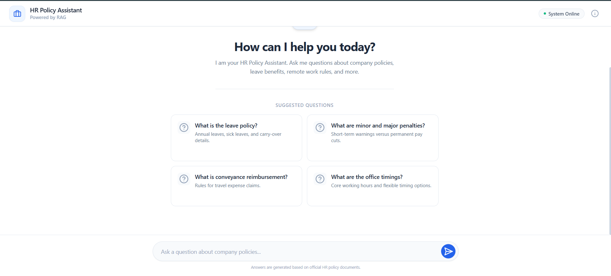
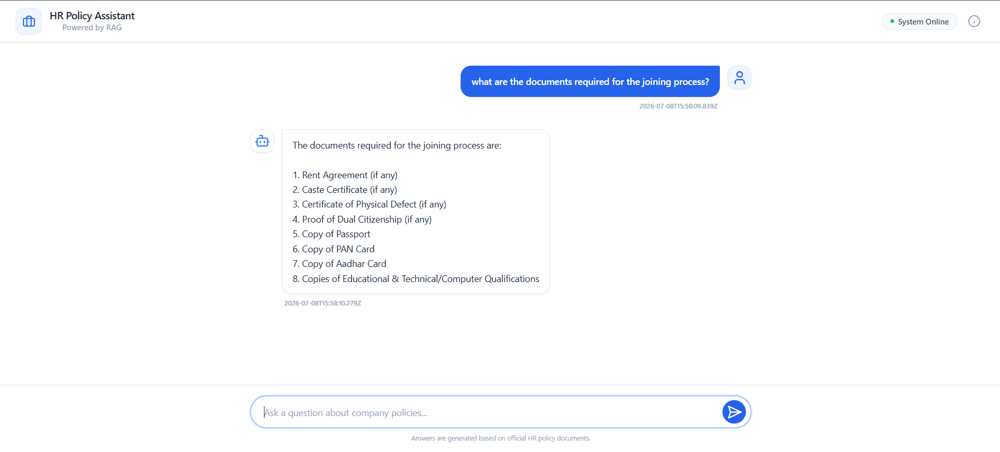

# 🧾 HR Policy Assistant (PDF RAG)

A Retrieval-Augmented Generation (RAG) chat assistant that answers employee questions about company HR policies — leave, reimbursements, penalties, joining formalities, and more — by grounding every answer in the actual policy PDFs, instead of relying on the LLM's general knowledge.

Built as a hands-on project to learn how production RAG pipelines work end-to-end: document processing, embeddings, vector search, prompt grounding, and serving an LLM behind a real API and UI.

---

## Demo

**Landing screen with suggested questions**


**Asking a policy question and getting a grounded answer**

---

## Features

- 📚 **PDF ingestion** — recursively loads all PDFs from a directory using `PyPDFLoader`
- ✂️ **Smart chunking** — splits documents into overlapping chunks with `RecursiveCharacterTextSplitter`
- 🧠 **Embeddings** — generates sentence embeddings with `sentence-transformers` (`all-MiniLM-L6-v2`)
- 🗄️ **Vector store** — persists embeddings in a local **ChromaDB** collection
- 🔎 **Semantic retrieval** — retrieves the top-k most relevant chunks for a query via cosine similarity
- 🤖 **LLM generation** — answers are generated by **Groq** (`openai/gpt-oss-20b`), grounded strictly in retrieved context
- 🌐 **REST API** — a FastAPI backend exposes a simple `/ask` endpoint
- 💬 **Chat UI** — a React + Vite + Tailwind frontend for asking questions and viewing answers

---

## Key Highlights

- Designed and implemented a **full RAG pipeline from scratch** — no high-level "one-liner" RAG frameworks, each stage (loading, chunking, embedding, storage, retrieval, generation) is explicit and understood
- Built a **persistent vector database layer** with ChromaDB, including incremental collection checks so re-ingestion only happens when needed
- Implemented **context-grounded prompting** to reduce hallucination — the LLM is explicitly instructed to say when it doesn't have enough information
- Exposed the pipeline through a **REST API** (FastAPI) with CORS configured for a separate frontend
- Built a **decoupled React frontend** that consumes the API independently, mirroring real-world client/server architecture

---

## Tech Stack

| Layer | Technology |
|---|---|
| Backend | FastAPI |
| Orchestration | LangChain |
| Embeddings | sentence-transformers |
| Vector DB | ChromaDB |
| LLM | Groq (`langchain-groq`) |
| PDF parsing | PyPDF / PyMuPDF |
| Frontend | React, Vite, Tailwind CSS |
| Package management | `uv` (Python), npm (frontend) |

---

## Project Structure

```
RAG/
├── main.py              # FastAPI app (exposes the /ask endpoint)
├── rag.py                # Core RAG pipeline: loading, chunking, embeddings, vector store, retrieval, LLM
├── requirements.txt      # Python dependencies (pip)
├── pyproject.toml        # Python dependencies (uv)
├── notebook/             # Jupyter notebooks used for prototyping the pipeline
│   ├── document.ipynb
│   └── pdf_loader.ipynb
├── data/
│   ├── pdf/               # Place your source PDFs here
│   └── vector_store/      # ChromaDB persistent storage (auto-created)
└── frontend/             # React chat interface
    └── src/
        ├── App.jsx
        └── components/
```

---

## How It Works

1. On startup, `rag.py` checks whether the ChromaDB collection already has documents.
2. If empty, it loads every PDF in `data/pdf/`, splits them into ~1000-character chunks (200-character overlap), embeds each chunk, and stores them in ChromaDB.
3. When a question comes in via `/ask`, the query is embedded and the top-k most similar chunks are retrieved.
4. The retrieved chunks are stuffed into a prompt that instructs the LLM to answer **only** from the given context — if the context isn't sufficient, it explicitly says so instead of hallucinating.
5. The answer is returned as JSON to the frontend and displayed in the chat window.

---

## Getting Started

### Prerequisites

- Python 3.13+
- Node.js 18+ and npm
- A [Groq API key](https://console.groq.com/)

### 1. Clone the repo

```bash
git clone <your-repo-url>
cd RAG
```

### 2. Backend setup

Using `uv` (recommended, matches `pyproject.toml`):

```bash
uv sync
```

Or with pip:

```bash
python -m venv venv
source venv/bin/activate   # Windows: venv\Scripts\activate
pip install -r requirements.txt
```

### 3. Configure environment variables

Create a `.env` file in the project root:

```
GROQ_API_KEY=your_groq_api_key_here
```

> ⚠️ Never commit your `.env` file. Make sure it's listed in `.gitignore`.

### 4. Add your PDFs

Place the HR policy PDFs (or any documents you want the assistant to answer from) inside:

```
data/pdf/
```

### 5. Run the backend

```bash
uvicorn main:app --reload
```

The first request will build the vector index from your PDFs (this may take a while depending on document size). Subsequent runs reuse the persisted index in `data/vector_store/`.

The API will be available at `http://127.0.0.1:8000`.

### 6. Run the frontend

```bash
cd frontend
npm install
npm run dev
```

The chat UI will be available at `http://localhost:5173`.

---

## API Reference

### `GET /`
Health check.

**Response**
```json
{ "message": "CORS configured successfully" }
```

### `POST /ask`
Ask a question about the ingested PDFs.

**Request body**
```json
{ "question": "What is the leave policy?" }
```

**Response**
```json
{ "answer": "..." }
```

---

## Configuration Notes

- **Chunking**: `chunk_size=1000`, `chunk_overlap=200` (adjustable in `rag.py`)
- **Embedding model**: `all-MiniLM-L6-v2` (adjustable via `EmbeddingManager`)
- **Retrieval**: `top_k=3` by default in `rag_simple`
- **LLM**: Groq `openai/gpt-oss-20b`, `temperature=0.1`, `max_tokens=1024`
- **CORS**: currently allows `http://localhost:5173` and `http://127.0.0.1:5173` — update `main.py` if deploying the frontend elsewhere

---

## Rebuilding the Vector Index

To force a rebuild (e.g., after adding new PDFs), delete the persisted store and restart the backend:

```bash
rm -rf data/vector_store
```

---
